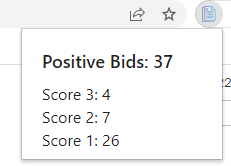

# Bids Counter for HotCRP

Chrome extension for counting the number of positive bids entered on HotCRP.

## Using the Pre-Built Extension

### Installation
* Download a pre-built extension (`extension.zip`) from [releases](releases/) and unzip
* Open Chrome, navigate to extensions, and enable developer mode
* Click "Load Unpacked" and navigate to the unzipped `build` directory
* The extension is now installed!

### Usage
* Open a submission website and go to Review preferences (e.g. https://sec23winter.usenix.hotcrp.com/reviewprefs)
* Click on the Bids Counter extension to see the number of positive bids you entered:

    

## Development
* For continuous builds use: `npm run watch`
  * The extension will be built in the `/build` folder, which you can then load into Chrome
  * With this option, the extension will automatically re-build whenever you make a change
* To build the extension once, use: `npm run build`

## Acknowledgements
* This project was bootstrapped with [Chrome Extension CLI](https://github.com/dutiyesh/chrome-extension-cli)
* Extension icon was created by [smalllikeart - Flatico](https://www.flaticon.com/free-icons/document)
